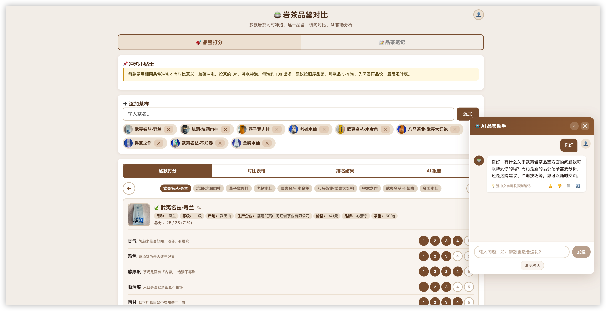
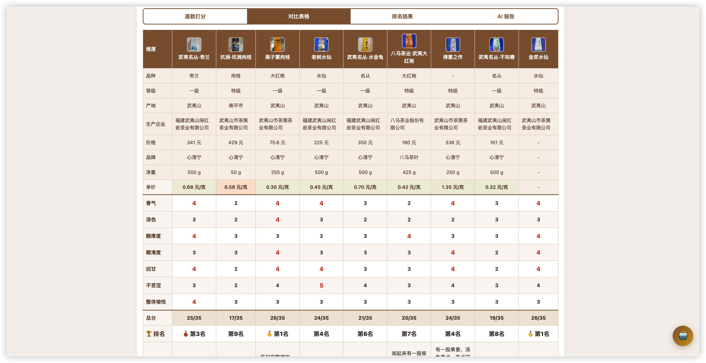
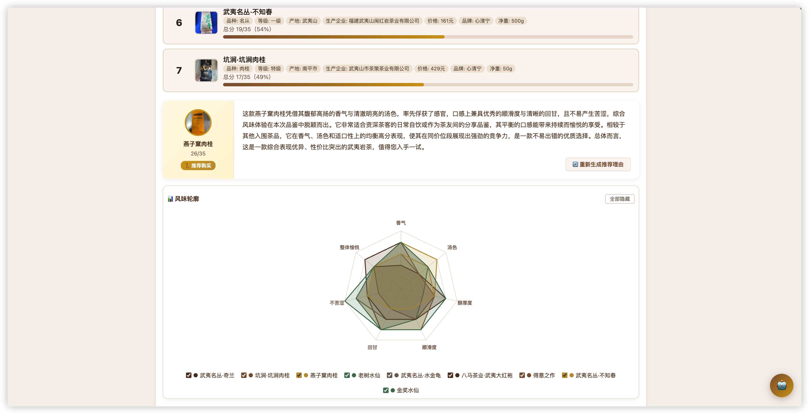
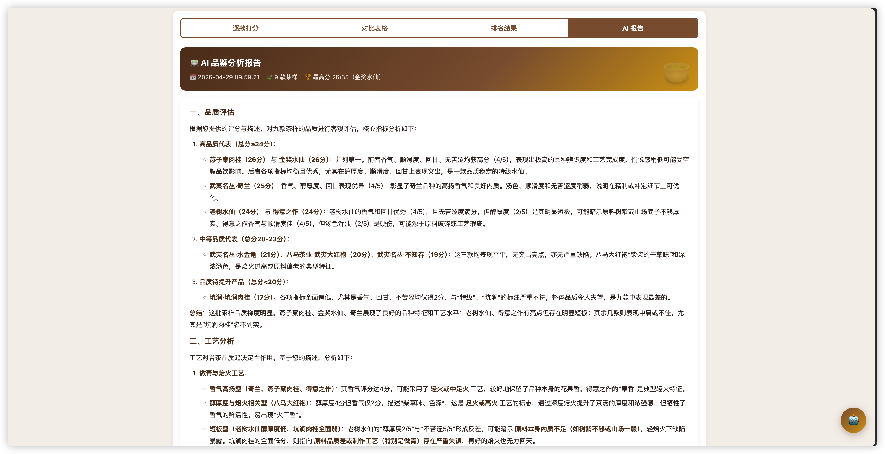
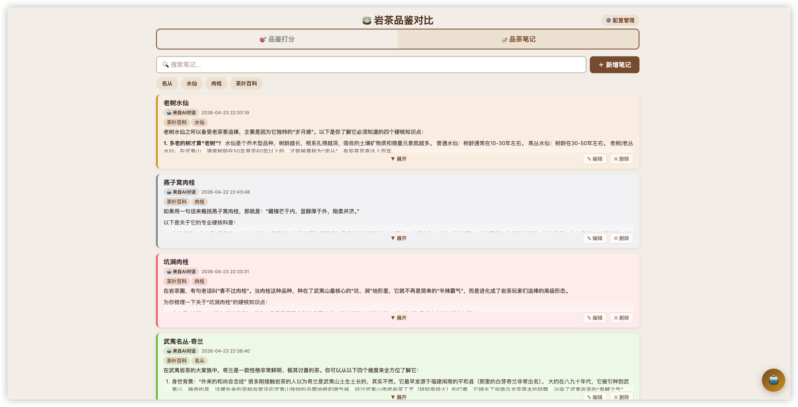
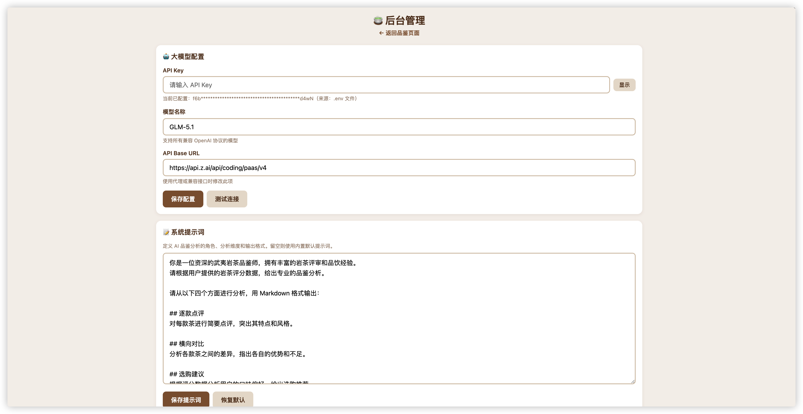
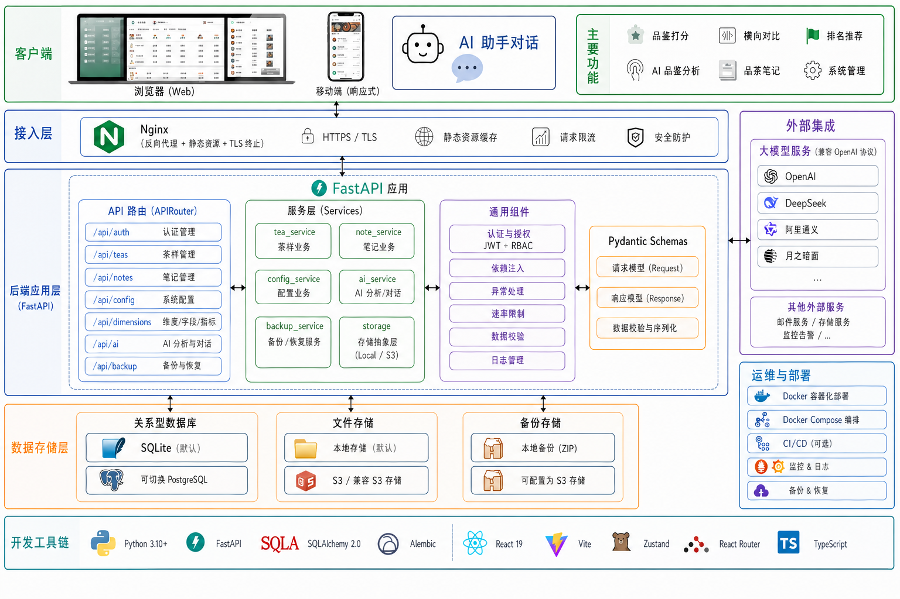

# 🍵 岩茶品鉴评分系统

一款专为武夷岩茶爱好者设计的品鉴打分与对比工具。支持多款茶样逐项打分、横向对比、排名推荐，以及 AI 品鉴分析。

## 📸 界面展示

<table>
  <tr>
    <td align="center"><b>品鉴打分</b></td>
    <td align="center"><b>对比表格</b></td>
  </tr>
  <tr>
    <td></td>
    <td></td>
  </tr>
  <tr>
    <td align="center"><b>排名结果</b></td>
    <td align="center"><b>AI 报告</b></td>
  </tr>
  <tr>
    <td></td>
    <td></td>
  </tr>
  <tr>
    <td align="center"><b>品茶笔记</b></td>
    <td align="center"><b>后台管理</b></td>
  </tr>
  <tr>
    <td></td>
    <td></td>
  </tr>
</table>


## ✨ 功能特性

| 功能 | 说明 |
|------|------|
| 🎯 逐款打分 | 七大维度（香气、汤色、醇厚度、顺滑度、回甘、不苦涩、整体愉悦），每项 1-5 分 |
| 📊 对比表格 | 多款茶样横向对比，信息行 + 评分维度 + 派生指标，最高分自动高亮 |
| 🏆 排名推荐 | 可视化排名进度条，自动推荐得分最高的茶样 |
| 📡 风味雷达图 | SVG 雷达图展示各款茶的风味轮廓，支持多茶叠加对比，可交互勾选显示/隐藏 |
| 📷 茶样照片 | 支持上传茶样图片，自动缩放优化 |
| ✏️ 动态字段 | 茶样信息字段（品种、产地、价格等）可在后台自由配置 |
| 💰 派生指标 | 根据价格和净重自动计算单价，色块渐变直观对比。指标可在后台自定义 |
| 🤖 AI 品鉴分析 | 接入大模型，自动生成逐款点评、横向对比、选购建议、冲泡建议 |
| 💬 AI 助手对话 | 浮动 AI 助手，可随时基于评分数据对话、追问品鉴建议 |
| 📝 品茶笔记 | 支持 Markdown 编辑、标题、彩色卡片展示、AI 对话划词收藏（新建或追加到已有笔记） |
| ⚙️ 后台管理 | 大模型配置、维度/字段/指标自定义、系统提示词编辑、数据备份恢复 |
| 🔐 用户认证 | JWT 认证，首个用户自动成为管理员，支持多用户 |
| 💾 备份恢复 | 一键导出/导入 ZIP 备份，含茶样数据、配置和图片 |

## 🚀 快速开始

### 环境要求

- Python 3.10+
- Node.js 18+（仅开发前端时需要）

### 方式一：本地开发

```bash
# 1. 克隆项目
git clone https://github.com/xianyuwu/tea-taster.git
cd tea-taster

# 2. 创建虚拟环境
python3 -m venv .venv
source .venv/bin/activate

# 3. 安装后端依赖
pip install -r requirements.txt

# 4. 配置环境变量
cp .env.example .env
# 编辑 .env 设置 SECRET_KEY 和 OPENAI_API_KEY

# 5. 启动后端（端口 5001）
python main.py

# 6. 前端开发（另开终端，可选）
cd frontend
npm install
npx vite --port 3003   # 端口可自定义，API 自动代理到 5001
```

访问：
- 品鉴页面：`http://localhost:5001`（或 `:3003` 开发模式）
- API 文档：`http://localhost:5001/docs`

### 方式二：Docker 部署

```bash
# 1. 配置环境变量
cp .env.example .env
# 编辑 .env 设置 SECRET_KEY（必填）和其他可选项

# 2. 启动
docker compose up -d --build

# 3. 访问
# http://your-domain
```

Docker Compose 包含：
- **app** 服务：FastAPI 后端 + 前端静态文件
- **nginx** 服务：反向代理 + TLS 终止 + 静态文件缓存

## 🤖 AI 分析配置

支持所有兼容 OpenAI 协议的模型服务。配置方式：

1. **管理后台配置**（推荐）：登录后进入管理后台 → 大模型配置 → 填写 API Key、模型名称、Base URL
2. **环境变量**：`.env` 文件中设置 `OPENAI_API_KEY`

API Key 优先级：环境变量 > `.env` 文件 > 管理后台配置

| 服务商 | Base URL | 模型示例 |
|--------|----------|----------|
| OpenAI | `https://api.openai.com/v1` | `gpt-4o`、`gpt-4o-mini` |
| DeepSeek | `https://api.deepseek.com/v1` | `deepseek-chat` |
| 阿里通义 | `https://dashscope.aliyuncs.com/compatible-mode/v1` | `qwen-plus` |
| 月之暗面 | `https://api.moonshot.cn/v1` | `moonshot-v1-8k` |

## 🧠 AI 功能实现

系统有三个 AI 功能，都通过 OpenAI 兼容协议调用大模型，SSE 流式返回。

### 1. AI 品鉴分析报告（`POST /api/ai/analyze`）

**触发**：品鉴页 → 报告标签 → 点击「AI 分析」

1. 后端从数据库收集所有有评分的茶样，拼成文本（各维度分数、总分、备注、额外字段）
2. System Prompt 定义 AI 为「资深武夷岩茶品鉴师」，要求从逐款点评、横向对比、选购建议、冲泡建议四个角度输出（可在管理后台自定义）
3. 调用大模型流式生成，每个 SSE chunk 实时推送到前端逐字渲染
4. 流结束后 BackgroundTask 将完整报告写入数据库（单例 `Report.id=1`，重新分析覆盖）
5. 茶样分数变更时自动标记报告为「过时」，前端提示重新分析

### 2. AI 购买推荐理由（`POST /api/ai/recommend`）

**触发**：排名列表页 → 点击「AI 生成推荐理由」

1. 后端收集评分数据，按总分排序找出第一名茶样
2. 使用独立的推荐 Prompt（不含 System Prompt），要求为第一名茶写 4-5 句购买推荐：核心风味、消费场景、独特优势、总结推荐语
3. 流式返回后存入 `Report.recommend` 列（与主报告分开存储）
4. 前端在排名列表的推荐卡片中展示，支持重新生成

### 3. AI 品鉴助手对话（`POST /api/ai/chat`）

**触发**：点击右下角 🤖 浮动按钮打开聊天面板

1. 首次对话时前端自动注入两条隐藏上下文：评分数据文本 + 已有报告内容
2. 每次请求携带完整对话历史（上下文 + 所有历史消息 + 当前问题），后端透传给大模型
3. 对话不做持久化，历史存在前端 Zustand store 中
4. 支持重新生成、点赞/点踩（持久化到数据库）、选中文字收藏到笔记

**设计要点**：对话管理在前端，后端只做 LLM 代理；和报告共用同一个 System Prompt，保证角色一致。

## 🏗️ 系统架构

<p align="center">
  
</p>
**后端**：FastAPI + SQLAlchemy 2.0 async + Alembic + JWT 认证

```
app/
├── __init__.py          # FastAPI 工厂 + 中间件
├── config.py            # 配置（pydantic-settings）
├── db.py                # 数据库引擎 + 会话管理
├── models.py            # ORM 模型（User, Tea, Report, Note, ConfigItem, AiFeedback）
├── routers/             # 7 个 APIRouter
│   ├── auth.py          # 注册/登录/刷新/改密码
│   ├── teas.py          # 茶样 CRUD + 照片上传
│   ├── notes.py         # 笔记 CRUD
│   ├── config_routes.py # 系统配置
│   ├── dimensions.py    # 维度/字段/指标
│   ├── ai.py            # AI 分析 + 对话（SSE）
│   └── backup.py        # 备份/恢复/清空
├── services/            # 业务逻辑层
│   ├── tea_service.py
│   ├── note_service.py
│   ├── config_service.py
│   ├── ai_service.py
│   ├── backup_service.py
│   └── storage.py       # 存储抽象层（Local/S3）
├── schemas/             # Pydantic 请求/响应模型
└── utils/               # JWT 认证、错误处理、速率限制、校验
```

**前端**：React 19 + Vite + Zustand + React Router

```
frontend/src/
├── api/                 # API 调用层（token 自动注入 + 401 刷新）
├── stores/              # Zustand 状态管理
├── pages/               # 页面组件（Login/Tasting/Admin）
├── components/          # UI 组件（tea/ai/note/auth/ui）
├── hooks/               # SSE 流式读取
└── styles/              # CSS 变量 + 全局样式（茶色主题）
```

**数据存储**：SQLite（默认，可切换 PostgreSQL）+ 文件存储（本地/S3）

## 📡 API 接口

### 认证

| 方法 | 路径 | 说明 |
|------|------|------|
| `POST` | `/api/auth/register-first` | 首个用户注册（自动成为管理员） |
| `POST` | `/api/auth/register` | 注册新用户（需管理员） |
| `POST` | `/api/auth/login` | 登录 |
| `POST` | `/api/auth/refresh` | 刷新 Token |
| `GET` | `/api/auth/me` | 当前用户信息 |
| `PUT` | `/api/auth/password` | 修改密码 |

### 茶样

| 方法 | 路径 | 说明 |
|------|------|------|
| `GET` | `/api/teas` | 获取所有茶样 |
| `POST` | `/api/teas` | 添加茶样 |
| `PUT` | `/api/teas/:id` | 更新茶样 |
| `DELETE` | `/api/teas/:id` | 删除茶样 |
| `POST` | `/api/teas/:id/photo` | 上传茶样图片 |

### AI & 报告

| 方法 | 路径 | 说明 |
|------|------|------|
| `POST` | `/api/ai/analyze` | AI 品鉴分析报告（SSE 流式） |
| `POST` | `/api/ai/recommend` | AI 购买推荐理由（SSE 流式） |
| `POST` | `/api/ai/chat` | AI 品鉴助手对话（SSE 流式） |
| `POST` | `/api/ai/feedback` | 提交对话反馈（点赞/点踩） |
| `GET` | `/api/ai/feedback` | 批量获取对话反馈状态 |
| `GET` | `/api/report` | 获取已保存的报告 |
| `DELETE` | `/api/report` | 删除报告 |

### 笔记 / 配置 / 备份

| 方法 | 路径 | 说明 |
|------|------|------|
| `GET/POST/PUT/DELETE` | `/api/notes[/:id]` | 笔记 CRUD |
| `GET/PUT` | `/api/config` | 系统配置 |
| `POST` | `/api/config/test` | 测试大模型连接 |
| `GET/PUT` | `/api/dimensions` | 评分维度 |
| `GET/PUT` | `/api/tea-fields` | 茶样字段 |
| `GET/PUT` | `/api/derived-metrics` | 派生指标 |
| `POST` | `/api/backup` | 创建备份 |
| `GET` | `/api/backups` | 备份列表 |
| `DELETE` | `/api/backups/:name` | 删除备份 |
| `POST` | `/api/restore` | 从备份恢复 |
| `DELETE` | `/api/data` | 清空所有数据 |

## 🔧 开发

```bash
# 数据库迁移（模型变更后）
alembic revision --autogenerate -m "description"
alembic upgrade head

# 前端构建
cd frontend && npm run build

# 运行测试
pytest

# 从旧 JSON 数据迁移（一次性）
python scripts/migrate_json_to_sqlite.py
```

## 📄 许可证

MIT License
