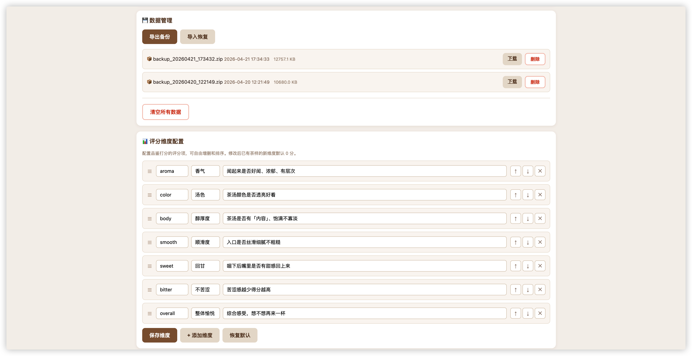

# 🍵 岩茶品鉴评分系统

一款专为武夷岩茶爱好者设计的品鉴打分与对比工具。支持多款茶样逐项打分、横向对比、排名推荐，以及 AI 品鉴分析。

## ✨ 功能特性

| 功能 | 说明 |
|------|------|
| 🎯 逐款打分 | 七大维度（香气、汤色、醇厚度、顺滑度、回甘、不苦涩、整体愉悦），每项 1-5 分 |
| 📊 对比表格 | 多款茶样横向对比，信息行（品种、产地等）+ 评分维度 + 单价对比，最高分自动高亮 |
| 🏆 排名推荐 | 可视化排名进度条，自动推荐得分最高的茶样 |
| 📷 茶样照片 | 支持拍照/上传茶样图片，悬浮放大预览 |
| ✏️ 茶样编辑 | 弹窗编辑茶样信息：名称、品种、等级、产地、生产企业、价格、品牌、净重 |
| 💰 单价对比 | 根据价格和净重自动计算元/克，色块渐变直观对比性价比 |
| 🤖 AI 品鉴分析 | 接入大模型，自动生成逐款点评、横向对比、选购建议、冲泡建议，报告自动保存，刷新不丢失 |
| 📄 报告导出 | 支持复制报告文本、导出排版精美的 PDF 文件 |
| 💬 AI 助手对话 | 浮动 AI 助手，可随时基于评分数据对话、追问品鉴建议 |
| 📝 品茶笔记 | 支持 Markdown 编辑（工具栏格式化）、标题、彩色卡片展示、AI 对话内容一键收藏 |
| ⚙️ 后台管理 | 大模型配置、评分维度自定义、系统提示词编辑、数据备份恢复 |
| 💾 备份恢复 | 一键导出/导入 ZIP 备份，含茶样数据、配置和图片 |

## 🖼️ 页面预览

**品鉴页面**（`/`）— 添加茶样 → 逐款打分 → 对比表格 → 排名结果 → AI 分析


**管理后台**（`/admin`）— 大模型配置、提示词编辑、数据管理、评分维度配置




## 🚀 快速开始

### 环境要求

- Python 3.8+
- macOS / Linux（Windows 需自行适配启动脚本）

### 方式一：双击启动（macOS 推荐）

1. 克隆仓库

```bash
git clone https://github.com/xianyuwu/tea-taster.git
cd tea-taster
```

2. 双击 `start.command` 文件

首次运行会自动创建虚拟环境（`.venv/`）并安装依赖，之后直接启动服务。

3. 浏览器自动打开 `http://localhost:5001`

> 如果无法双击运行，请在终端执行：
> ```bash
> chmod +x start.command
> ./start.command
> ```

### 方式二：手动启动

```bash
# 1. 克隆并进入项目目录
git clone https://github.com/xianyuwu/tea-taster.git
cd tea-taster

# 2. 创建虚拟环境
python3 -m venv .venv
source .venv/bin/activate    # macOS/Linux
# .venv\Scripts\activate     # Windows

# 3. 安装依赖
pip install -r requirements.txt

# 4. 启动服务
python server.py
```

启动后访问：

- 品鉴页面：`http://localhost:5001`
- 管理后台：`http://localhost:5001/admin`

## 🤖 AI 分析配置

AI 品鉴分析需要配置大模型 API，支持所有兼容 OpenAI 协议的模型服务。

### 方式一：管理后台配置（推荐）

1. 打开 `http://localhost:5001/admin`
2. 在「大模型配置」中填写 API Key、模型名称和 Base URL
3. 点击「测试连接」验证，然后「保存配置」

### 方式二：环境变量配置

在项目根目录创建 `.env` 文件：

```env
OPENAI_API_KEY=sk-xxxxxxxxxxxxxxxx
```

### 支持的模型服务

| 服务商 | Base URL | 模型示例 |
|--------|----------|----------|
| OpenAI | `https://api.openai.com/v1` | `gpt-4o`、`gpt-4o-mini` |
| DeepSeek | `https://api.deepseek.com/v1` | `deepseek-chat` |
| 阿里通义 | `https://dashscope.aliyuncs.com/compatible-mode/v1` | `qwen-plus` |
| 月之暗面 | `https://api.moonshot.cn/v1` | `moonshot-v1-8k` |
| 其他 | 对应服务的兼容端点 | — |

> 💡 API Key 优先级：环境变量 > `.env` 文件 > 管理后台配置

> ⚡ 保存配置后立即生效，无需重启服务

## 💬 AI 助手对话

页面右下角的浮动 AI 助手支持随时对话：

| 状态 | 对话能力 |
|------|---------|
| 无茶样 | 提示添加茶样 |
| 有茶样无评分 | 提示先打分 |
| 有评分无报告 | 基于评分数据回答问题（如"哪款茶更好？"） |
| 有报告 | 可追问，基于报告内容深入分析 |

**交互特性：**
- 对话窗口左侧可拖拽调整宽度
- 流式输出，打字机效果
- 清空对话不影响品鉴分析报告

## 📝 品茶笔记

顶部「品茶笔记」Tab 管理所有品鉴心得：

| 特性 | 说明 |
|------|------|
| Markdown 编辑 | 工具栏支持加粗、斜体、标题、列表、引用、代码等格式 |
| 标题 | 每条笔记可设标题，醒目显示 |
| 实时预览 | 点击「👁 预览」切换查看渲染效果 |
| 彩色卡片 | 不同笔记用不同柔和配色展示 |
| AI 收藏 | AI 对话中的回复可一键收藏为笔记 |
| 数据持久化 | 笔记自动保存到 `data/notes.json`，包含在备份中 |

## 📄 报告持久化与导出

**自动保存：** AI 分析报告自动保存到服务端，刷新页面后报告仍在，无需重新生成。

**过期提示：** 当茶样增删或评分变更时，已有报告会标记为"过时"，页面显示提示并提供「重新分析」按钮。

**导出 PDF：** 点击报告底部的「📄 导出 PDF」按钮，会在新窗口中渲染排版好的报告，通过浏览器打印功能保存为 PDF 文件。

**复制文本：** 点击「📋 复制文本」可复制报告的原始 Markdown 文本，方便粘贴到其他地方。

## 🏗️ 系统架构


## 📁 项目结构

```
tea-taster/
├── server.py           # Flask 后端服务（API + 静态文件，~720 行）
├── index.html          # 品鉴页面（打分、对比、排名、AI 分析，~3700 行）
├── admin.html          # 管理后台（配置、备份、维度管理，~660 行）
├── requirements.txt    # Python 依赖（flask, openai）
├── start.command       # macOS 一键启动脚本
├── .gitignore
├── .env                # API Key 配置（不入库）
└── data/               # 运行时数据（不入库）
    ├── teas.json       # 茶样评分数据
    ├── config.json     # 系统配置
    ├── notes.json      # 品茶笔记
    ├── photos/         # 茶样图片
    └── backups/        # 自动备份
```

## 📡 API 接口

| 方法 | 路径 | 说明 |
|------|------|------|
| `GET` | `/api/teas` | 获取所有茶样 |
| `POST` | `/api/teas` | 添加茶样 |
| `PUT` | `/api/teas/:id` | 更新评分/备注 |
| `DELETE` | `/api/teas/:id` | 删除茶样 |
| `POST` | `/api/teas/:id/photo` | 上传茶样图片 |
| `GET` | `/api/dimensions` | 获取评分维度 |
| `PUT` | `/api/dimensions` | 更新评分维度 |
| `GET` | `/api/config` | 获取配置（Key 脱敏） |
| `PUT` | `/api/config` | 更新配置 |
| `POST` | `/api/config/test` | 测试大模型连接 |
| `POST` | `/api/ai/analyze` | AI 品鉴分析（SSE 流式，自动保存报告） |
| `GET` | `/api/report` | 获取已保存的分析报告 |
| `DELETE` | `/api/report` | 删除分析报告 |
| `POST` | `/api/ai/chat` | AI 对话追问（SSE 流式） |
| `GET` | `/api/notes` | 获取所有笔记 |
| `POST` | `/api/notes` | 新增笔记（支持标题 + Markdown） |
| `PUT` | `/api/notes/:id` | 更新笔记 |
| `DELETE` | `/api/notes/:id` | 删除笔记 |
| `POST` | `/api/backup` | 创建备份 |
| `GET` | `/api/backups` | 备份列表 |
| `GET` | `/api/backups/:name` | 下载备份 |
| `DELETE` | `/api/backups/:name` | 删除备份 |
| `POST` | `/api/restore` | 从备份恢复 |
| `DELETE` | `/api/data` | 清空所有数据 |

## 🔧 常见问题

**Q: 关闭终端后服务停止了怎么办？**

使用 `nohup` 后台运行：

```bash
nohup .venv/bin/python server.py > tea-app.log 2>&1 &
```

**Q: 如何修改评分维度？**

进入管理后台（`/admin`）→「评分维度配置」，支持增删、拖拽排序。修改后已有茶样的新维度默认 0 分。

**Q: AI 分析报错"未配置 API Key"？**

请确认以下任一方式已配置：
1. 项目根目录 `.env` 文件中写入 `OPENAI_API_KEY=你的key`
2. 管理后台中填写 API Key 并保存
3. 设置环境变量 `export OPENAI_API_KEY=你的key`

**Q: 如何更换大模型？**

进入管理后台 →「大模型配置」→ 修改模型名称和 Base URL → 保存。

**Q: 数据存在哪里？**

所有数据存储在项目目录的 `data/` 文件夹中，包括茶样评分（`teas.json`）、系统配置（`config.json`）、茶样图片（`photos/`）和备份文件（`backups/`）。该目录已加入 `.gitignore`，不会被提交到代码仓库。

## 📄 许可证

MIT License
